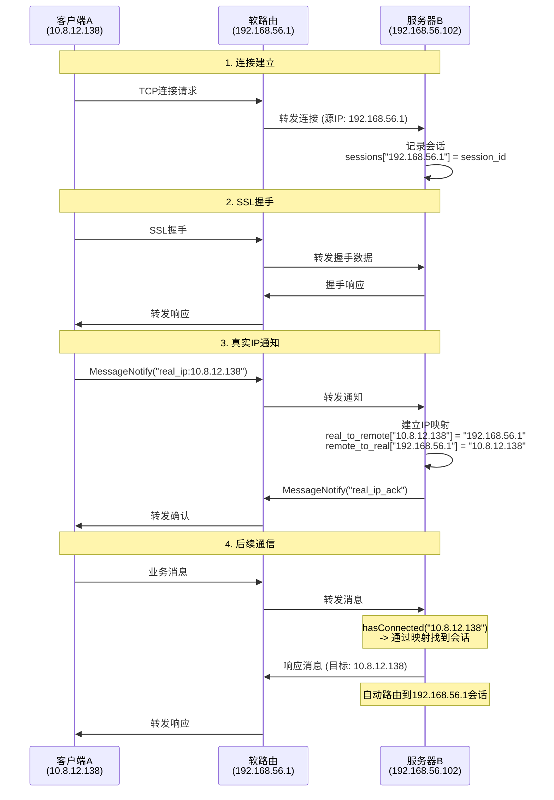

# NAT/软路由环境下的IP映射解决方案

## 问题描述

在NAT/软路由网络环境中，客户端的真实IP与服务器收到的远程端点IP不一致，导致响应时无法找到正确的会话。

### 示例场景
- 客户端A: 10.8.12.138
- 服务器B: 192.168.56.102  
- 软路由: 192.168.56.1

A通过软路由连接到B时，B收到的连接IP是192.168.56.1，但当需要向10.8.12.138发送响应时，会话查找失败。

## 解决方案

### 1. 自动IP映射（推荐）

系统会自动检测本机真实IP并建立映射关系：

```cpp
// 在SessionWorker中，连接时会自动设置真实IP
SessionWorker worker;
worker.netTouch(targetAddress, port);  // 自动使用getFirstIp()检测到的真实IP
```

### 2. 手动设置真实IP

如果自动检测不准确，可以手动指定：

```cpp
SessionWorker worker;

// 手动设置真实IP（在连接前或连接后都可以）
worker.setRealIP("10.8.12.138");

// 建立连接
worker.netTouch("192.168.56.102", port);

// 查询当前设置的真实IP
QString realIP = worker.getRealIP();
```

### 3. 底层协议支持

#### 客户端（ProtoClient）
```cpp
ProtoClient client;

// 设置真实IP
client.setRealIP("10.8.12.138");

// 连接到服务器
client.ConnectAsync();
// 握手完成后会自动发送 "real_ip:10.8.12.138" 通知
```

#### 服务器端（ProtoServer）
```cpp
// 服务器会自动处理客户端的真实IP通知
// 建立映射：10.8.12.138 -> 192.168.56.1

// hasConnected现在支持两种查找方式：
bool connected1 = server.hasConnected("192.168.56.1");    // 直接匹配
bool connected2 = server.hasConnected("10.8.12.138");     // 通过IP映射
```

## 工作流程



### 关键步骤说明

1. **连接建立**：客户端通过软路由连接服务器，服务器记录远程端点IP
2. **真实IP通知**：握手完成后，客户端自动发送真实IP给服务器
3. **IP映射建立**：服务器建立双向IP映射关系
4. **透明路由**：后续通信自动通过映射找到正确的会话

## 调试信息

系统会输出详细的调试日志：

```
// 连接时
Set real IP for client: 10.8.12.138 (auto-detected)
Sent real IP notification: 10.8.12.138 to server

// 服务器端
Received real IP notification: 10.8.12.138 from remote: 192.168.56.1
Setting up IP mapping: real_ip=10.8.12.138 -> remote_ip=192.168.56.1
IP mapping established successfully

// 会话查找时
check hasConnected: 10.8.12.138
hasConnected: 10.8.12.138 true (via IP mapping: 192.168.56.1)

// 消息发送时
Found session via IP mapping: 10.8.12.138 -> 192.168.56.1
```

## 线程安全

- 所有IP映射操作都使用读写锁保护
- 锁顺序：mapping_lock -> session_lock（避免死锁）
- 使用RAII确保锁的正确释放
- 连接断开时自动清理IP映射

## 兼容性

- 完全向后兼容，不影响现有功能
- 不需要修改协议定义
- 对于非NAT环境，功能透明，不产生额外开销

## 故障排除

### 常见问题

1. **IP映射未建立**
   - 检查客户端是否调用了`setRealIP()`
   - 查看日志确认真实IP通知是否发送成功

2. **会话查找失败**
   - 确认hasConnected()使用的IP是否正确
   - 检查IP映射是否已建立（查看调试日志）

3. **消息路由失败**
   - 确认onSend()方法中的目标IP
   - 查看是否找到了对应的会话

### 调试建议

1. 启用详细日志输出
2. 检查网络拓扑和IP地址分配
3. 验证防火墙和路由配置
4. 使用网络抓包工具分析通信流程 