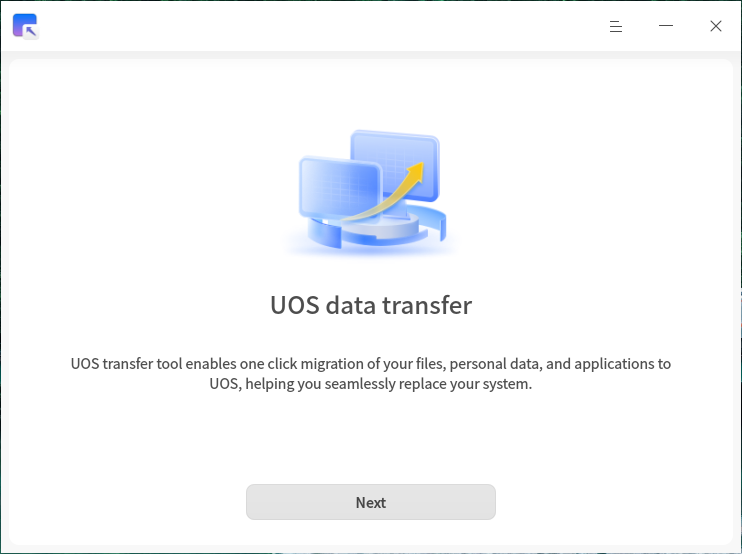
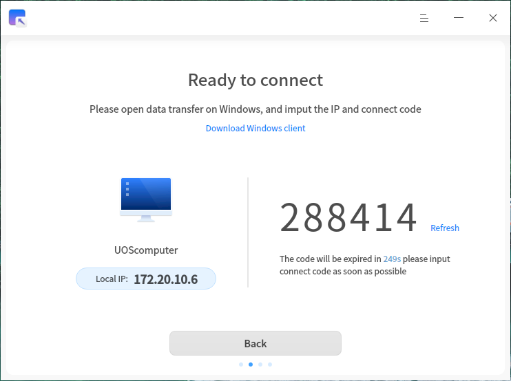
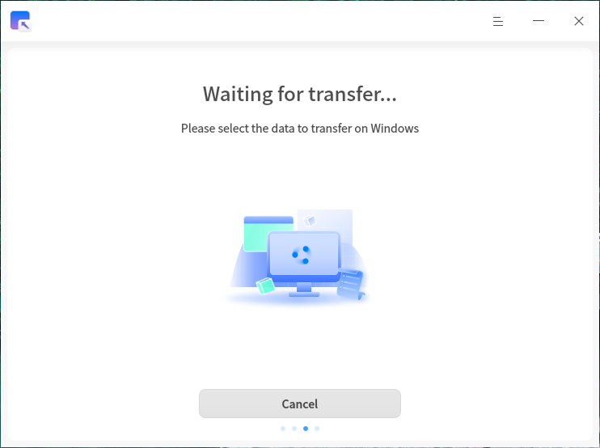
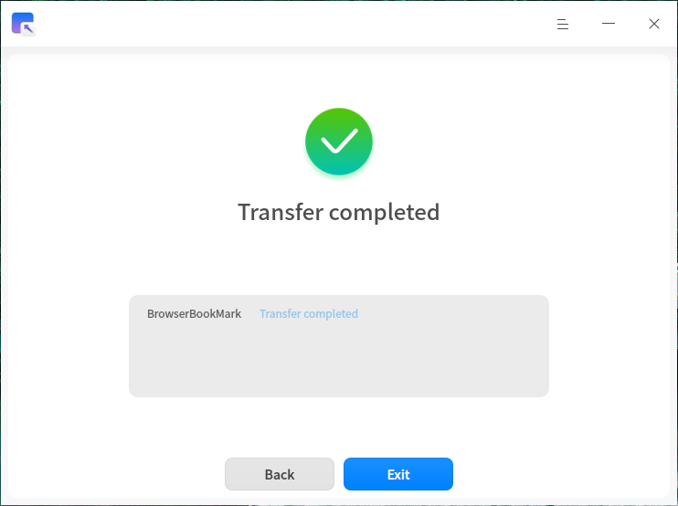

# UOS Migration Tool|deepin-data-transfer|

## Overview

The UOS Migration Tool is a data transfer application that enables you to migrate your personal and application data from a Windows device to a UOS device with a single click, helping you seamlessly switch operating systems.

## Getting Started

You can launch, exit, or create shortcuts for the UOS Migration Tool using the following methods.

### Launching the UOS Migration Tool

1. Click the launcher icon on the taskbar  to open the launcher.
2. Scroll through the list or use the search function to locate the UOS Migration Tool icon , then click to launch.
3. Right-click the icon  to access the following options:
   - Click **Send to Desktop** to create a desktop shortcut.
   - Click **Send to Taskbar** to pin the application to the taskbar.
   - Click **Start on Boot** to add the application to the startup list so it launches automatically when the computer boots.

## Establishing a Connection

### Preparation

Before starting the migration process, please ensure that:

1. The Migration Tool is running on both the sending (Windows) and receiving (UOS) devices;
2. Both devices are connected to the same local area network (LAN);
3. The network connection is stable.

### Connection Steps

1. After launching the Migration Tool on the UOS device, the system will automatically display the local IP address and connection password;
2. On the Windows device, enter the IP address and password shown on the UOS device;
3. Click the **Connect** button to send a connection request.

>  Note: Each connection session supports data transfer between only one pair of devices.

**UOS Device:**

**Windows Device:**

## Selecting Data to Migrate

After a successful connection:

1. The UOS device will display a "Waiting for Transfer" status;
2. The Windows device will show a list of data available for migration;
3. On the Windows device, select the types of data you wish to migrate. The tool will automatically calculate and display the quantity and size of the selected data.

**UOS Device:**

**Windows Device:**

## Executing Data Transfer

After confirming the data to migrate on the Windows side, click **Start Migration** to begin the transfer. A progress bar will indicate the transfer status. The duration depends on your network bandwidth and the size of the files.

>  If a network issue interrupts the transfer, you can click **Resume Transfer** after reconnecting to continue the previous migration task.

## Migration Complete

Once the migration is complete, you can view the results on the UOS device. The transferred data will be stored in your `/home` directory.

## Main Menu

In the main menu, you can switch the window theme, access the help manual, view information about the tool, or exit the application.

### Theme

Three theme options are available: Light, Dark, and System default.

1. On the main interface of the UOS Migration Tool, click .
2. Select **Theme** and choose your preferred theme.

### Help

View the help manual for more information about using the UOS Migration Tool.

1. On the main interface of the UOS Migration Tool, click .
2. Select **Help**.
3. Read the detailed user guide.

### About

1. On the main interface of the UOS Migration Tool, click .
2. Select **About**.
3. View version information and feature highlights of the tool.

### Exit

1. On the main interface of the UOS Migration Tool, click .
2. Select **Exit** to close the application.
