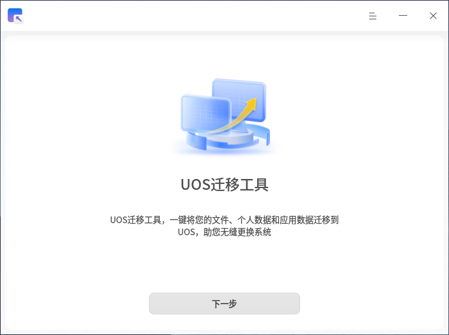
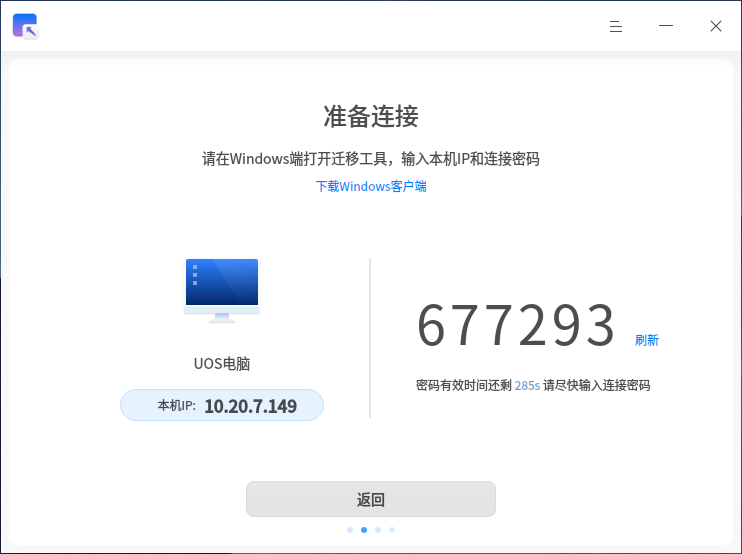
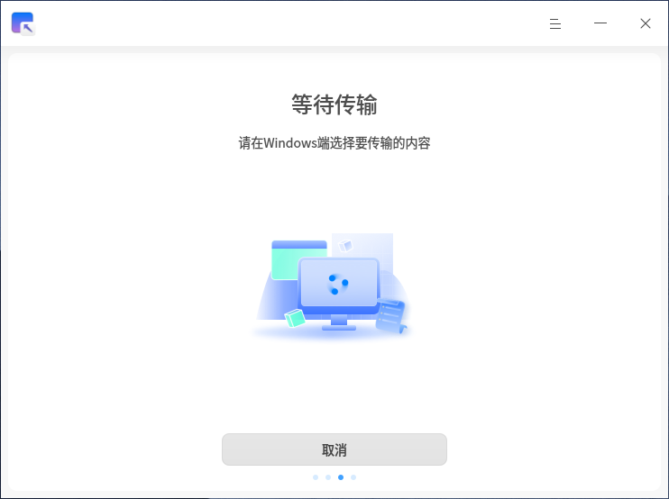
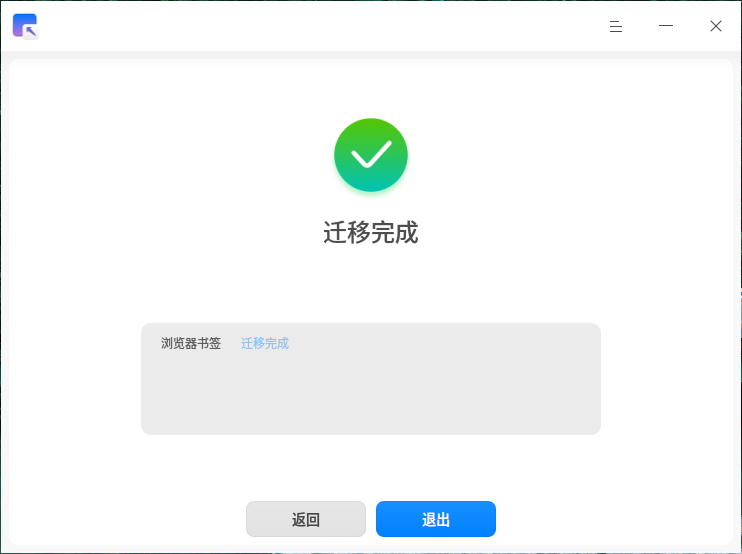

# UOS迁移工具|deepin-data-transfer|

## 概述

UOS迁移工具是一款数据迁移工具，可以一键将您的个人数据和应用数据从Windows端传输到UOS端，帮助您实现无缝更换系统。

## 使用入门

您可以通过以下方式启动、退出UOS迁移工具，或创建快捷方式。

### 启动UOS迁移工具

1. 单击任务栏上的启动器图标 ，进入启动器界面。
2. 上下滚动鼠标滚轮浏览或通过搜索功能，找到UOS迁移工具图标，单击启动。
3. 右键单击图标 ，您可以执行以下操作：
   - 单击 **发送到桌面**，在桌面创建快捷方式。
   - 单击 **发送到任务栏**，将应用程序固定到任务栏。
   - 单击 **开机自动启动**，将应用程序添加到开机启动项，在电脑开机时自动启动该应用程序。

## 建立连接

### 连接准备

在开始迁移前，请确保：

1. 发送端(Windows)和接收端(UOS)同时运行UOS迁移工具；
2. 两台设备处于同一局域网内；
3. 网络连接稳定。

### 连接步骤

1. 在UOS端启动迁移工具后，系统将自动显示本机IP地址和连接密码；
2. 在Windows端输入UOS端的IP地址和连接密码；
3. 单击 **连接** 按钮发送连接请求。

>  注意：每次连接仅支持一对设备间的数据传输。

**UOS端：**

**Windows端：**

## 选择迁移数据

成功建立连接后：

1. UOS端将显示等待传输状态；
2. Windows端将显示可选择迁移的数据列表；
3. 在Windows端勾选需要迁移的数据类型，统将自动计算并显示所选数据的数据量及数据大小。

**UOS端：**

**Windows端：**

## 执行数据传输

在Windows端确认迁移数据范围后，单击 **开始迁移** 进行数据传输，并展示传输进度。数据传输时间取决于带宽及需要传输的文件大小。

> 若您在传输过程中出现网络问题导致传输中断，待重新建立连接成功后，您可以单击 **继续传输** 继续上次的传输任务。

## 数据迁移完成

数据传输完成后，您可以在UOS端查看数据迁移结果。传输完成的数据，将被存放在您的/home目录下。

## 主菜单

在主菜单中，您可以切换窗口主题、查看帮助手册、退出UOS迁移工具等。

### 主题

窗口主题包含浅色主题、深色主题和系统主题。

1. 在UOS迁移工具主界面，单击 。
2. 选择 **主题**，选择一种主题颜色。

### 帮助

查看帮助手册，进一步了解和使用UOS迁移工具。

1. 在UOS迁移工具主界面，单击 。
2. 选择 **帮助**。
3. 查看UOS迁移工具的详细帮助手册。

### 关于

1. 在UOS迁移工具主界面，单击 。
2. 选择 **关于**。
3. 查看UOS迁移工具的版本信息和功能介绍。

### 退出

1. 在UOS 迁移工具主界面，单击 。
2. 选择 **退出**。

