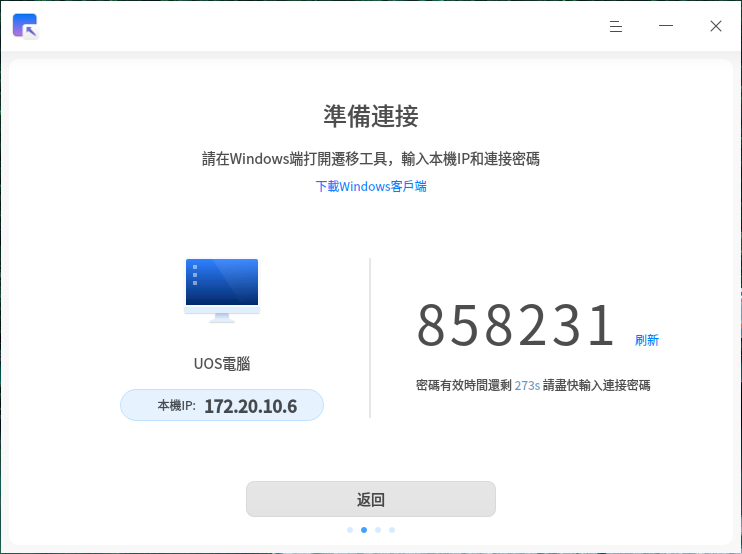
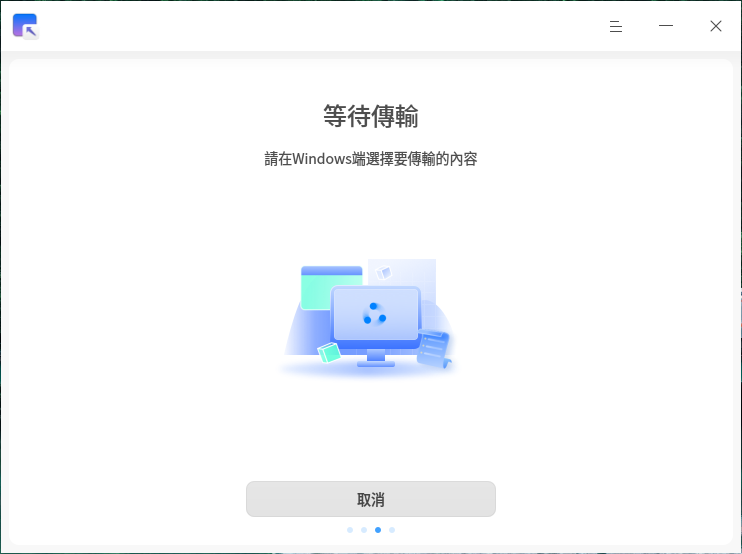
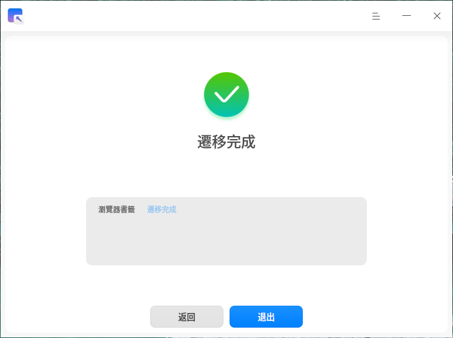

# UOS遷移工具|deepin-data-transfer|

## 概述

UOS遷移工具是一款數據遷移工具，可以一鍵將您的個人數據和應用數據從Windows端傳輸到UOS端，幫助您實現無縫更換系統。

## 使用入門

您可以通過以下方式啟動、退出UOS遷移工具，或創建快捷方式。

### 啟動UOS遷移工具

1. 單擊任務欄上的啟動器圖標 ，進入啟動器界面。
2. 上下滾動鼠標滾輪瀏覽或通過搜索功能，找到UOS遷移工具圖標，單擊啟動。
3. 右鍵單擊圖標 ，您可以執行以下操作：
   - 單擊 **發送到桌面**，在桌面創建快捷方式。
   - 單擊 **發送到任務欄**，將應用程式固定到任務欄。
   - 單擊 **開機自動啟動**，將應用程式添加到開機啟動項，在電腦開機時自動啟動該應用程式。

## 建立連接

### 連接準備

在開始遷移前，請確保：

1. 發送端(Windows)和接收端(UOS)同時運行UOS遷移工具；
2. 兩台設備處於同一局域網內；
3. 網絡連接穩定。

### 連接步驟

1. 在UOS端啟動遷移工具後，系統將自動顯示本機IP位址和連接密碼；
2. 在Windows端輸入UOS端的IP位址和連接密碼；
3. 單擊 **連接** 按鈕發送連接請求。

>  注意：每次連接僅支持一對設備間的數據傳輸。

**UOS端：**

**Windows端：**

## 選擇遷移數據

成功建立連接後：

1. UOS端將顯示等待傳輸狀態；
2. Windows端將顯示可選擇遷移的數據列表；
3. 在Windows端勾選需要遷移的數據類型，統將自動計算並顯示所選數據的數據量及數據大小。

**UOS端：**

**Windows端：**

## 執行數據傳輸

在Windows端確認遷移數據範圍後，單擊 **開始遷移** 進行數據傳輸，並展示傳輸進度。數據傳輸時間取決於帶寬及需要傳輸的文件大小。

> 若您在傳輸過程中出現網絡問題導致傳輸中斷，待重新建立連接成功後，您可以單擊 **繼續傳輸** 繼續上次的傳輸任務。

## 數據遷移完成

數據傳輸完成後，您可以在UOS端查看數據遷移結果。傳輸完成的數據，將被存放在您的/home目錄下。

## 主菜單

在主菜單中，您可以切換窗口主題、查看幫助手冊、退出UOS遷移工具等。

### 主題

窗口主題包含淺色主題、深色主題和系統主題。

1. 在UOS遷移工具主界面，單擊 。
2. 選擇 **主題**，選擇一種主題顏色。

### 幫助

查看幫助手冊，進一步了解和使用UOS遷移工具。

1. 在UOS遷移工具主界面，單擊 。
2. 選擇 **幫助**。
3. 查看UOS遷移工具的詳細幫助手冊。

### 關於

1. 在UOS遷移工具主界面，單擊 。
2. 選擇 **關於**。
3. 查看UOS遷移工具的版本資訊和功能介紹。

### 退出

1. 在UOS 遷移工具主界面，單擊 。
2. 選擇 **退出**。
