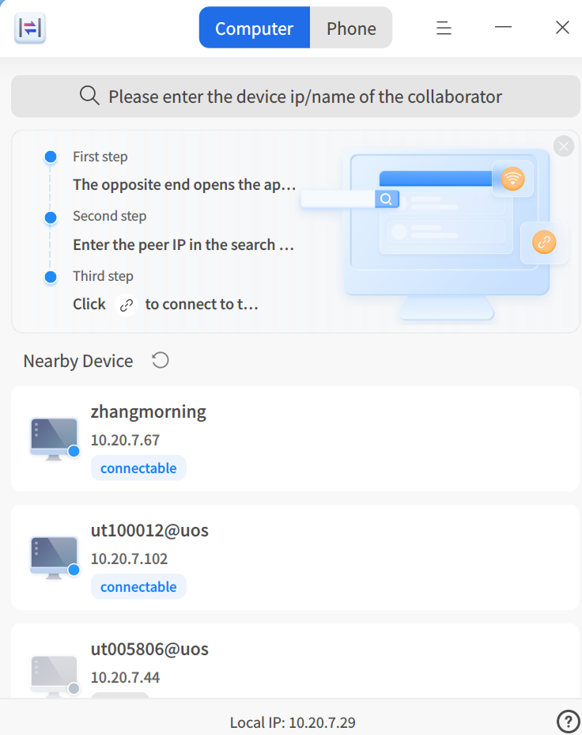
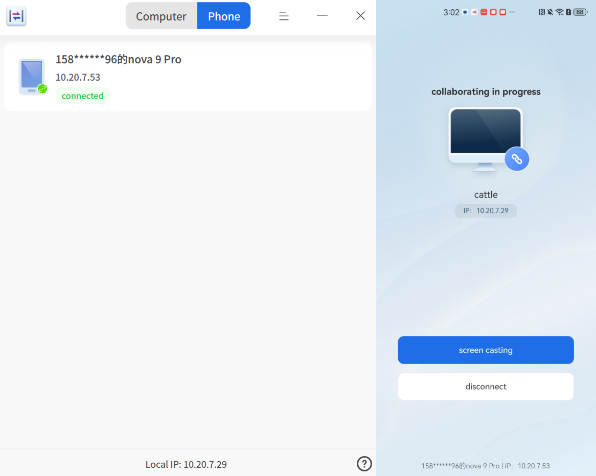

# Cross-Device Collaboration|dde-cooperation|

## Overview

Cross-Device Collaboration is a tool that enables multi-device collaborative work, allowing file transfer, keyboard/mouse sharing, and clipboard sharing between UOS/deepin and Windows devices. It also supports screen mirroring from mobile devices to UOS/deepin devices and direct control of mobile devices.

For UOS/deepin devices, you can obtain the "Cross-Device Collaboration" app by searching for it in the **App Store**. For Windows and mobile devices (currently only supporting certain Android models), visit [https://www.chinauos.com/resource/assistant](https://www.chinauos.com/resource/assistant) to download the app.

## Computer Collaboration

### Connecting Devices

**1. Select a device from the device list**

When the "Cross-Device Collaboration" app is launched, it automatically scans for other devices on the same ***network segment***. Detected devices will appear in the app's device list, as shown below:

Locate the target device (identified by computer name or IP), click the connect button , and complete the connection between the two devices.

**2. Connect by searching for the device IP**

Enter the target device's IP in the search box, click the connect button , and complete the connection between the two devices.

### File Transfer

**1. Transfer files via the device list's file transfer button**

When two devices are connected, click  in the device list interface. In the file selection window, choose the file to send, click **OK**, and the file transfer will begin.

**2. Transfer files via right-click menu**

Right-click the file you want to send, select **Send to > File Transfer**, and choose the target device from the list to start the transfer. If transferring to a Windows device, ensure the "Cross-Device Collaboration" app on the Windows side remains open.

### Keyboard/Mouse Sharing

When devices A and B are connected, and the keyboard/mouse sharing option is enabled in device B's settings, you can use device A's mouse and keyboard to directly control device B. The mouse can move between the screens of both devices based on the screen alignment setting.

### Clipboard Sharing

When devices A and B are connected, and the "Clipboard Sharing" option is enabled in the initiating device's settings, both devices will share a clipboard, allowing you to copy on device A and paste on device B.

## Mobile Collaboration

### Connecting Devices

Switch the top navigation bar of the "Cross-Device Collaboration" app to the "Mobile Collaboration" page to display a connection QR code. After downloading the "UOS Assistant" app on your mobile device, scan the QR code to establish a connection. The connection process is shown below:

### Screen Mirroring and Control

On the mobile device, click the "Screen Mirroring" button, grant **screen privacy** permissions, and enable **accessibility services** for UOS Assistant in the device settings. This will mirror the mobile screen to the UOS/deepin device, allowing you to directly control the mobile device by clicking on the mirrored screen.

## Cross-Device Collaboration Settings

Click the title bar icon  and select **Settings** to access the configuration interface.

1. **Discoverable**  
   Controls whether the device can be automatically detected by other devices on the same network segment. Options: Everyone, Not Allowed.

2. **Device Nickname**  
   Helps other devices identify you. Defaults to the device's computer name.

3. **Peripheral Sharing**  
   When enabled, allows the keyboard, mouse, or touchpad of the connected device to control this device.

4. **Connection Direction**  
   Controls the screen alignment relationship with the connected device.

5. **Allow File Transfers From**  
   Controls which users on the same LAN can send files to you. Options: Everyone, Connected Devices, Not Allowed.

6. **File Save Location**  
   Sets the storage path for received files. Defaults to a folder named after the sender's device nickname in the current user's Downloads directory. You can also specify another directory.

7. **Clipboard Sharing**  
   Controls whether the clipboard is shared with the connected device. The initiating device acts as the server; enabling this feature allows both devices to share the clipboard.

## Frequently Asked Questions

Q: Why can't I see my other device in the device list?  
A: Possible reasons include:  
1. Both devices must have the "Cross-Device Collaboration" app running to be discoverable.  
2. The devices are not on the same LAN or are on the same LAN but different network segments. Ensure they are on the same LAN and search for the target device's IP if needed.  
3. Check Settings > Discoverable > "Allow everyone on the same LAN."

Q: How do I check if my devices are on the same network segment?  
A: Typically, compare the first three parts of the IP address. If they match, the devices are on the same segment.

Q: Is data transmission in Cross-Device Collaboration or file transfer secure?  
A: Data is serialized using protobuf and encrypted with SSL/TLS 1.3 to ensure security during transmission.

Q: Why can't my Android phone connect to my computer?  
A: Currently, only certain Android models are supported. More models will be added in future updates.

Q: How do I control my phone from the computer after screen mirroring?  
A: After mirroring, enable "Accessibility Services" for UOS Assistant in your phone's settings. The exact steps vary by model. For example, on a Huawei nova 9 Pro (HarmonyOS 4.2.0), go to: Settings > Accessibility > Installed Services, find UOS Assistant, and enable it.