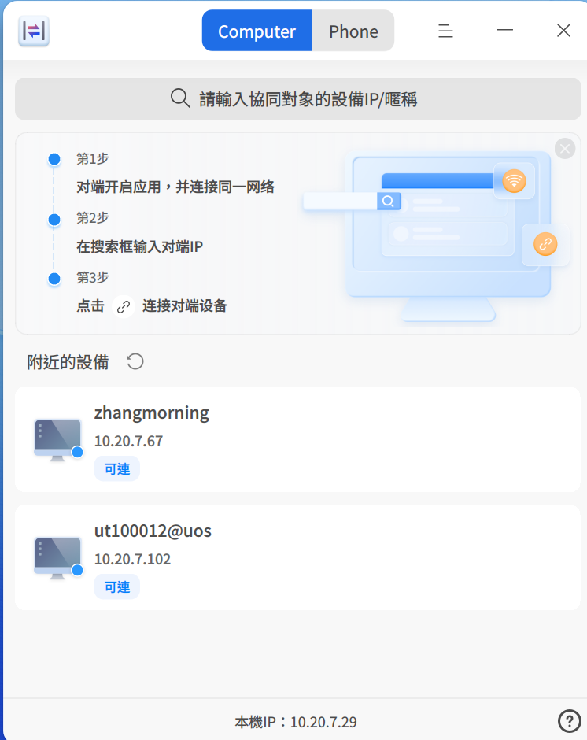

# 跨端協同|dde-cooperation|

## 概述

跨端協同係實現多設備協同辦公嘅工具，可在 UOS/deepin 與 Windows 設備間實現文件傳輸、鍵鼠與剪貼板共享，同時可將移動端屏幕投屏至 UOS/deepin 設備，並實現對移動端嘅直接操控。

UOS/deepin端可通過在**應用商店**中搜索「跨端協同」獲取應用；Windows和移動端（當前僅支持部分安卓機型）應用可訪問[https://www.chinauos.com/resource/assistant](https://www.chinauos.com/resource/assistant)獲取。

## 電腦協同

### 連接設備

**1. 通過設備列表選擇連接設備**

在「跨端協同」應用開啟後，設備會自動掃描同一***網段***下嘅其他設備，被掃描出來嘅設備會顯示在應用嘅設備列表中，如下圖：

找到目標協同設備（可通過計算機名、IP進行識別），點擊連接後，完成兩台設備嘅連接。

**2. 通過搜索設備IP連接設備**

在搜索框內，搜索目標協同設備嘅IP，點擊連接後，完成兩台設備嘅連接。

### 文件投送

**1. 通過協同設備列表-文件投送按鈕進行投送**

當兩台設備處於協同狀態下，在設備列表界面點擊，在選擇文件窗口中，選擇需要發送嘅文件，點擊**確定**，即開始文件投送。

**2. 通過文件-右鍵菜單進行投送**

鼠標右鍵點擊想要發送嘅文件，選擇**發送到-文件投送**，在設備列表中，選擇需要投送嘅目標設備，即開始文件投送。如果是投送到Windows端，需要將Windows端嘅跨端協同應用保持開啟狀態。

### 鍵鼠共享

當A、B兩台設備處於協同狀態時，且B電腦嘅設置項中鍵鼠共享開關處於開啟時，使用A電腦嘅鼠標、鍵盤可直接控制B電腦。鼠標可根據設置項中嘅屏幕拼接方式在兩台電腦嘅顯示屏之間互相穿透。

### 剪貼板共享

當A、B兩台設備處於協同狀態時，且發起共享嘅設備設置項中嘅「剪貼板共享」開關處於開啟時，兩台電腦將共享一個剪貼板，可以實現在A設備中複製，B設備中粘貼嘅功能。

## 手機協同

### 連接設備

將「跨端協同」應用頂部導航欄切換至「手機協同」頁，會出現連接二維碼，在手機下載「UOS助手」後，掃描二維碼即可建立連接，下圖為連接中嘅頁面。

### 投屏和控制

在移動端，點擊「投屏」按鈕，授權**屏幕隱私**權限，並為UOS助手啟用輔助功能中嘅**無障礙服務**，即可將手機屏幕投屏至UOS/deepin設備，並可在UOS/deepin設備上點擊投屏屏幕，來直接操控手機。

## 跨端協同設置

您可以通過點擊標題欄選擇**設置**進入跨端協同嘅設置界面。

1. 可被發現

用於控制當前設備是否可被其他同網段下嘅設備自動搜索，可以選擇所有人、不允許。

2. 設備暱稱

便於其他設備通過此暱稱發現你，設備暱稱默認為此設備嘅計算機名。

3. 外設共享

開啟後，允許協同中嘅另外一台設備嘅鍵盤、鼠標、觸控板控制此設備。

4. 連接方向

用於控制與協同設備屏幕拼接嘅位置關係。

5. 允許以下用戶向我投送文件

用於控制同一局域網內其他用戶向我投送文件嘅權限，可選擇所有人、正在協同嘅人、不允許。

6. 文件保存位置

設置接收到嘅文件嘅儲存路徑，默認在當前用戶下載目錄下以對方設備暱稱命名嘅文件夾內。您也可以設置選擇其他目錄作為默認存儲路徑。

7. 剪貼板共享

控制是否與協同嘅設備公用剪貼板。協同嘅發起方作為服務端，只要發起方開啟此功能，雙方即共享剪貼板。

## 常見問題

Q：為什麼在設備列表中無法發現我嘅另外一台設備？

A：無法發現設備有以下幾種情況，請逐一排查：

1. 設備都需開啟「跨端協同」應用，才可以被發現；
2. 設備不在同一局域網，或者在同一個局域網但不在同一個網段。此種情況下，請先確保兩台設備在同一個局域網下，然後在搜索框內搜索目標設備嘅IP來發現設備；
3. 檢查設置-可被發現-「允許同一局域網下嘅所有人」。

Q：如何判斷我嘅兩台設備是否在同一網段下？

A：通常情況下，可以檢查IP地址嘅前三位，如果都一致即在同一網段下。

Q：跨端協同或者文件投送中嘅數據傳輸是否安全？

A：數據採用protobuf序列化後SSL/TLS1.3加密傳輸，保證傳輸過程數據嘅安全。

Q：為什麼我嘅安卓手機無法和電腦建立協同？

A：當前手機和電腦協同僅支持部分安卓機型，後續我們將會適配更多機型。

Q：手機在電腦上投屏後，如何在電腦上操控手機？

A：若已經投屏至電腦，需在手機輔助功能中嘅「無障礙服務」中將UOS助手列為啟動狀態。每款機型嘅設置方式可能不同，以華為nova 9 Pro機型（HarmonyOS 4.2.0）為例，設置路徑為：設置-輔助功能-無障礙-其他-已安裝嘅服務，在應用列表中找到UOS助手，並設為啟用。