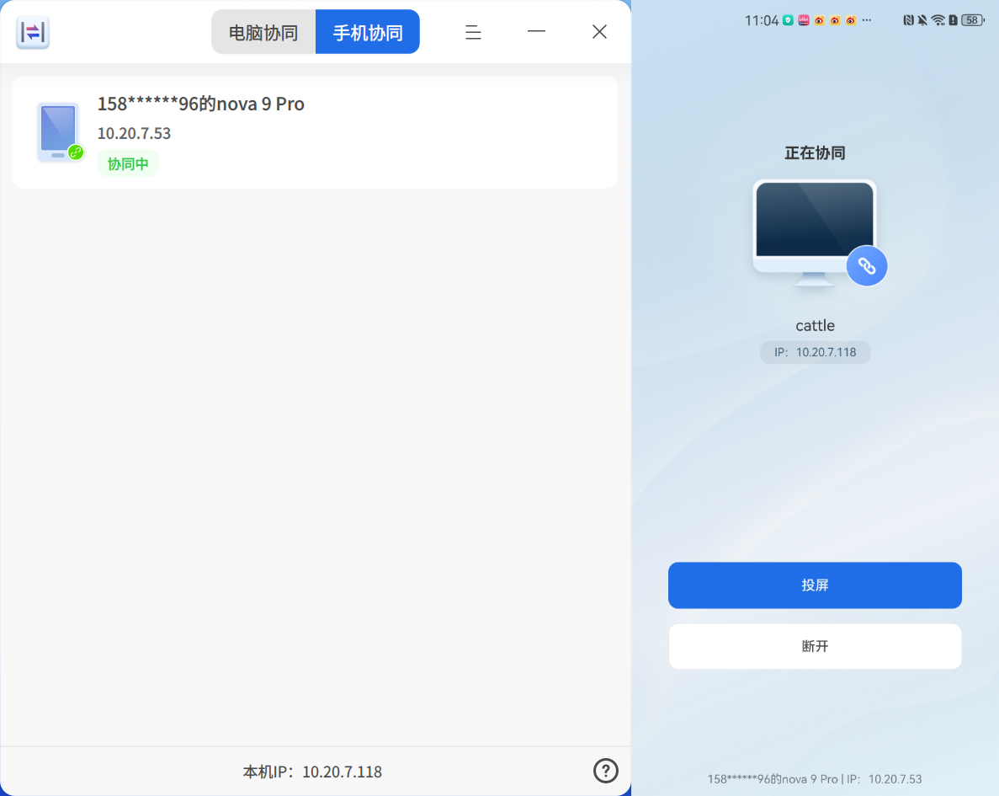

# 跨端協同|dde-cooperation|

## 概述

跨端協同是實現多裝置協同辦公的工具，可在 UOS/deepin 與 Windows 裝置間實現檔案傳輸、鍵鼠與剪貼簿共享，同時可將行動裝置螢幕投屏至 UOS/deepin 裝置，並實現對行動裝置的直接操控。

UOS/deepin端可透過在**應用商店**中搜尋「跨端協同」取得應用；Windows和行動端（目前僅支援部分安卓機型）應用可造訪[https://www.chinauos.com/resource/assistant](https://www.chinauos.com/resource/assistant)取得。

## 電腦協同

### 連接裝置

**1. 透過裝置列表選擇連接裝置**

在「跨端協同」應用開啟後，裝置會自動掃描同一***網段***下的其他裝置，被掃描出來的裝置會顯示在應用的裝置列表中，如下圖：

找到目標協同裝置（可透過電腦名稱、IP進行識別），點擊連接後，完成兩台裝置的連接。

**2. 透過搜尋裝置IP連接裝置**

在搜尋框內，搜尋目標協同裝置的IP，點擊連接後，完成兩台裝置的連接。

### 檔案傳送

**1. 透過協同裝置列表-檔案傳送按鈕進行傳送**

當兩台裝置處於協同狀態下，在裝置列表介面點擊，在選擇檔案視窗中，選擇需要傳送的檔案，點擊**確定**，即開始檔案傳送。

**2. 透過檔案-右鍵選單進行傳送**

滑鼠右鍵點擊想要傳送的檔案，選擇**傳送到-檔案傳送**，在裝置列表中，選擇需要傳送的目標裝置，即開始檔案傳送。如果是傳送到Windows端，需要將Windows端的跨端協同應用保持開啟狀態。

### 鍵鼠共享

當A、B兩台裝置處於協同狀態時，且B電腦的設定項中鍵鼠共享開關處於開啟時，使用A電腦的滑鼠、鍵盤可直接控制B電腦。滑鼠可根據設定項中的螢幕拼接方式在兩台電腦的顯示器之間互相穿透。

### 剪貼簿共享

當A、B兩台裝置處於協同狀態時，且發起共享的裝置設定項中的「剪貼簿共享」開關處於開啟時，兩台電腦將共享一個剪貼簿，可以實現在A裝置中複製，B裝置中貼上的功能。

## 手機協同

### 連接裝置

將「跨端協同」應用頂部導覽列切換至「手機協同」頁，會出現連接QR碼，在手機下載「UOS助手」後，掃描QR碼即可建立連接，下圖為連接中的頁面。

### 投屏和控制

在行動端，點擊「投屏」按鈕，授權**螢幕隱私**權限，並為UOS助手啟用輔助功能中的**無障礙服務**，即可將手機螢幕投屏至UOS/deepin裝置，並可在UOS/deepin裝置上點擊投屏螢幕，來直接操控手機。

## 跨端協同設定

您可以透過點擊標題列選擇**設定**進入跨端協同的設定介面。

1. 可被發現

用於控制目前裝置是否可被其他同網段下的裝置自動搜尋，可以選擇所有人、不允許。

2. 裝置暱稱

便於其他裝置透過此暱稱發現你，裝置暱稱預設為此裝置的電腦名稱。

3. 外設共享

開啟後，允許協同中的另外一台裝置的鍵盤、滑鼠、觸控板控制此裝置。

4. 連接方向

用於控制與協同裝置螢幕拼接的位置關係。

5. 允許以下用戶向我傳送檔案

用於控制同一區域網路內其他用戶向我傳送檔案的權限，可選擇所有人、正在協同的人、不允許。

6. 檔案儲存位置

設定接收到的檔案的儲存路徑，預設在目前用戶下載目錄下以對方裝置暱稱命名的資料夾內。您也可以設定選擇其他目錄作為預設儲存路徑。

7. 剪貼簿共享

控制是否與協同的裝置共用剪貼簿。協同的發起方作為伺服器端，只要發起方開啟此功能，雙方即共享剪貼簿。

## 常見問題

Q：為什麼在裝置列表中無法發現我的另外一台裝置？

A：無法發現裝置有以下幾種情況，請逐一排查：

1. 裝置都需開啟「跨端協同」應用，才可以被發現；
2. 裝置不在同一區域網路，或者在同一個區域網路但不在同一個網段。此種情況下，請先確保兩台裝置在同一個區域網路下，然後在搜尋框內搜尋目標裝置的IP來發現裝置；
3. 檢查設定-可被發現-「允許同一區域網路下的所有人」。

Q：如何判斷我的兩台裝置是否在同一網段下？

A：通常情況下，可以檢查IP位址的前三位，如果都一致即在同一網段下。

Q：跨端協同或者檔案傳送中的資料傳輸是否安全？

A：資料採用protobuf序列化後SSL/TLS1.3加密傳輸，保證傳輸過程資料的安全。

Q：為什麼我的安卓手機無法和電腦建立協同？

A：目前手機和電腦協同僅支援部分安卓機型，後續我們將會適配更多機型。

Q：手機在電腦上投屏後，如何在電腦上操控手機？

A：若已經投屏至電腦，需在手機輔助功能中的「無障礙服務」中將UOS助手列為啟動狀態。每款機型的設定方式可能不同，以華為nova 9 Pro機型（HarmonyOS 4.2.0）為例，設定路徑為：設定-輔助功能-無障礙-其他-已安裝的服務，在應用列表中找到UOS助手，並設為啟用。